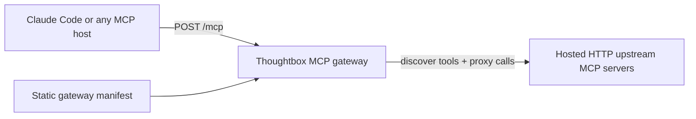

# Thoughtbox Architecture

Thoughtbox currently has a working standalone gateway runtime.

That is not the final contract.

The real target is a Dedalus-marketplace-compatible Thoughtbox runtime built on the Dedalus MCP scaffold.

The current runtime is:

- a Streamable HTTP MCP server
- a two-tool public surface
- a static manifest of hosted HTTP upstream MCP servers
- a proxy layer that discovers upstream tools and forwards tool calls

This section should describe the gateway that exists today, not the earlier multi-agent reasoning product story.

## Current Documents

| Document | Status | What it covers |
|----------|--------|----------------|
| [Server Architecture](./server-architecture.md) | Current | The live gateway runtime, MCP surface, manifest loading, discovery flow, proxy call flow, and Docker packaging model |
| [Dedalus Marketplace Compatibility Audit](./dedalus-marketplace-compatibility-audit.md) | Current | Contract-first audit of Thoughtbox versus the Dedalus MCP scaffold; identifies keep/adapt/replace work |
| [Dedalus Runtime Rehost Plan](./dedalus-runtime-rehost-plan.md) | Current | File-level migration plan for transplanting the gateway core onto the Dedalus scaffold/runtime contract |
| [Infrastructure](./infrastructure.md) | Mixed | Deployment notes and infrastructure context; parts may still reflect older hosted assumptions |
| [Auth and Billing](./auth-and-billing.md) | Historical | Older hosted auth and billing model; not part of the active gateway smoke-tested path |
| [Data Model](./data-model.md) | Historical | Older persistent data model; not part of the active gateway smoke-tested path |

## Current System Summary

## Reading Order

If you want to understand the current implementation and the real target, read in this order:

1. [Dedalus Marketplace Compatibility Audit](./dedalus-marketplace-compatibility-audit.md)
2. [Dedalus Runtime Rehost Plan](./dedalus-runtime-rehost-plan.md)
3. [Server Architecture](./server-architecture.md)
4. [README](../../README.md)
5. [src/gateway/registry.ts](/Users/b.c.nims/dev/kastalien-research/dedalus-2026/tb-bloomsday/src/gateway/registry.ts)

## Scope Boundary

The validated gateway path is:

1. client connects to Thoughtbox over MCP
2. `thoughtbox_search` returns the live upstream tool catalog
3. `thoughtbox_execute` calls an upstream tool through `tb.gateway.call()`

That is the current architectural center of gravity for the standalone runtime.

The target architectural center of gravity is different:

1. Dedalus scaffold owns transport/auth/client-compatibility boundaries
2. Thoughtbox supplies the gateway logic inside that shell
3. marketplace deployment, not generic standalone hosting, is the acceptance path
