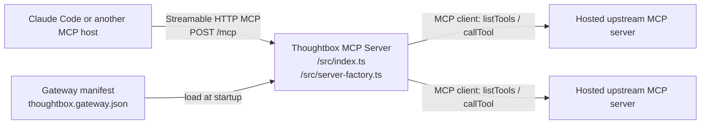
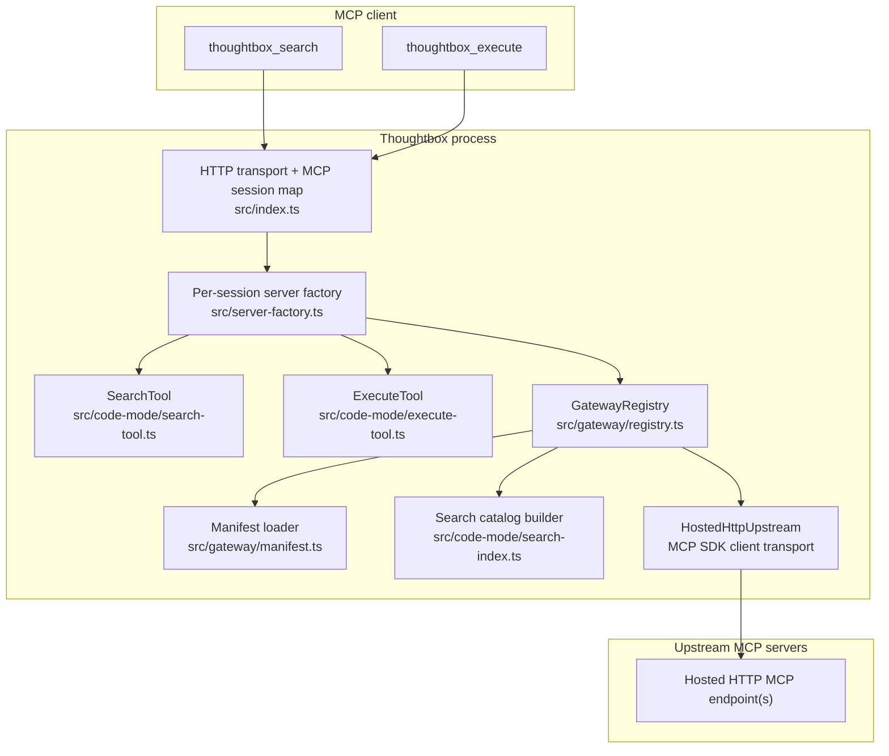
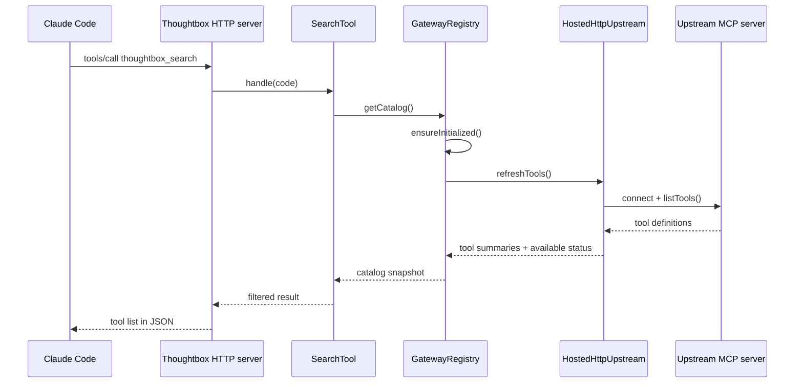
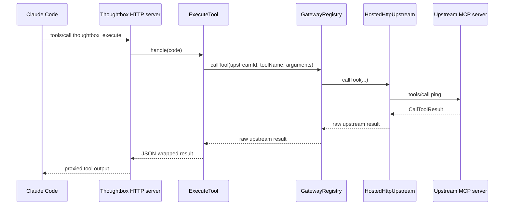
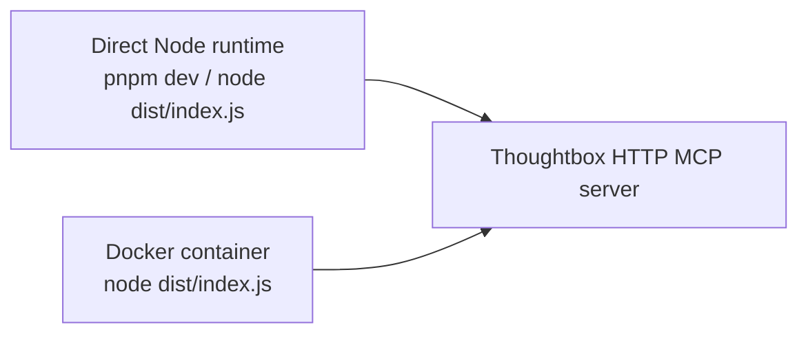

# Server Architecture

## Overview

Thoughtbox is currently a code-mode-first MCP gateway.

The active server surface is intentionally small:

- `thoughtbox_search`
- `thoughtbox_execute`

Clients connect to `POST /mcp` over Streamable HTTP. Thoughtbox loads a static gateway manifest, discovers tools from hosted HTTP upstream MCP servers, and lets clients call those tools through the two-tool code-mode interface.

This document describes the runtime that exists today and matches the smoke test that was validated against the local fixture upstream.

## Current Scope

What is in scope right now:

- Hosted HTTP MCP upstreams
- Tool discovery
- Tool proxying
- Static manifest loading from `thoughtbox.gateway.json` or `THOUGHTBOX_GATEWAY_MANIFEST`
- Direct Node runtime or Docker packaging around the same server process

What is not in scope for the gateway path:

- Resource proxying
- Prompt proxying
- Dynamic upstream registry mutation
- DAuth or runtime key injection

## System Context



For the smoke test, the upstream was the local fixture server from [scripts/demo/gateway-fixture.ts](/Users/b.c.nims/dev/kastalien-research/dedalus-2026/tb-bloomsday/scripts/demo/gateway-fixture.ts), and the manifest was [thoughtbox.gateway.demo.json](/Users/b.c.nims/dev/kastalien-research/dedalus-2026/tb-bloomsday/thoughtbox.gateway.demo.json).

## Main Components



### Responsibilities

| Component | Responsibility |
|----------|----------------|
| `src/index.ts` | Starts the HTTP server, owns the in-memory MCP session map, routes `/mcp` requests, and creates per-session server instances |
| `src/server-factory.ts` | Registers the two public tools and wires them to a `GatewayRegistry` |
| `src/gateway/manifest.ts` | Loads and validates the static manifest, including optional header interpolation from environment variables |
| `src/gateway/registry.ts` | Maintains upstream connections, refreshes tool catalogs, and proxies tool calls |
| `src/code-mode/search-tool.ts` | Runs sandboxed JavaScript over the gateway catalog |
| `src/code-mode/execute-tool.ts` | Runs sandboxed JavaScript over the `tb.gateway` SDK object |

## Public Tool Surface

### `thoughtbox_search`

`thoughtbox_search` receives JavaScript and executes it against a catalog with two arrays:

- `catalog.upstreams`
- `catalog.tools`

The catalog is synthesized from the live `GatewayRegistry` snapshot. The tool does not talk to upstream servers directly; it reads the already-built catalog.

### `thoughtbox_execute`

`thoughtbox_execute` receives JavaScript and executes it against a small `tb` SDK object:

- `tb.gateway.listUpstreams()`
- `tb.gateway.listTools()`
- `tb.gateway.getCatalog()`
- `tb.gateway.refresh()`
- `tb.gateway.call()`

`tb.gateway.call()` is the actual proxy path to upstream MCP tools.

## Discovery Flow

The first search or execute call causes the registry to initialize and discover upstream tools.



Important detail: discovery is lazy. Thoughtbox does not need a separate background sync loop for the current implementation. The first request that needs gateway state triggers `refresh()`.

## Proxy Call Flow



In the validated smoke test, this path returned:

```json
{
  "ok": true,
  "upstream": "gateway-fixture",
  "greeting": "pong:Claude Code"
}
```

## Request Lifecycle

At a high level, each new MCP session looks like this:

1. HTTP request arrives at `/mcp`
2. `src/index.ts` checks for an existing `mcp-session-id`
3. If no session exists, Thoughtbox creates a new `McpServer` instance through `createMcpServer()`
4. `createMcpServer()` builds a `GatewayRegistry` from the manifest and registers `thoughtbox_search` and `thoughtbox_execute`
5. The request is handled through the MCP transport
6. Subsequent requests on the same MCP session reuse the same transport and server instance

The MCP sessions themselves are still stored in memory in the Thoughtbox process.

## Manifest and Upstream Model

The manifest schema is intentionally small:

```json
{
  "version": 1,
  "upstreams": [
    {
      "id": "fixture",
      "name": "Gateway Fixture",
      "url": "http://127.0.0.1:1741/mcp",
      "headers": {
        "x-api-key": "${EXAMPLE_API_KEY}"
      },
      "enabled": true
    }
  ]
}
```

Current behavior:

- duplicate upstream IDs are rejected
- JSON and YAML manifests are supported
- header values may interpolate environment variables
- upstream status is tracked as `available`, `unavailable`, or `disabled`

## Docker vs Direct Node Runtime

The gateway architecture is the same in both cases.



Docker is packaging and network topology, not a separate application architecture. The current [docker-compose.yml](/Users/b.c.nims/dev/kastalien-research/dedalus-2026/tb-bloomsday/docker-compose.yml) simply:

- builds the image from [Dockerfile](/Users/b.c.nims/dev/kastalien-research/dedalus-2026/tb-bloomsday/Dockerfile)
- publishes port `1731`
- sets `PORT=1731`
- mounts `./.thoughtbox` into `/data/thoughtbox`

For a host-local upstream fixture, Docker needs a manifest that points to `host.docker.internal` rather than `127.0.0.1`, because `127.0.0.1` from inside the container refers to the container itself.

## Notes on Legacy Code Still in Tree

Large parts of the previous Thoughtbox codebase still exist in `src/`, including persistence, protocols, prompts, notebooks, and evaluation wiring.

Today, those are not the primary product story.

The active happy path for the gateway is:

1. load manifest
2. discover upstream tools
3. expose catalog through `thoughtbox_search`
4. proxy tool calls through `thoughtbox_execute`

Anything outside that path should be treated as legacy or transitional unless it is explicitly pulled back into the gateway design.
